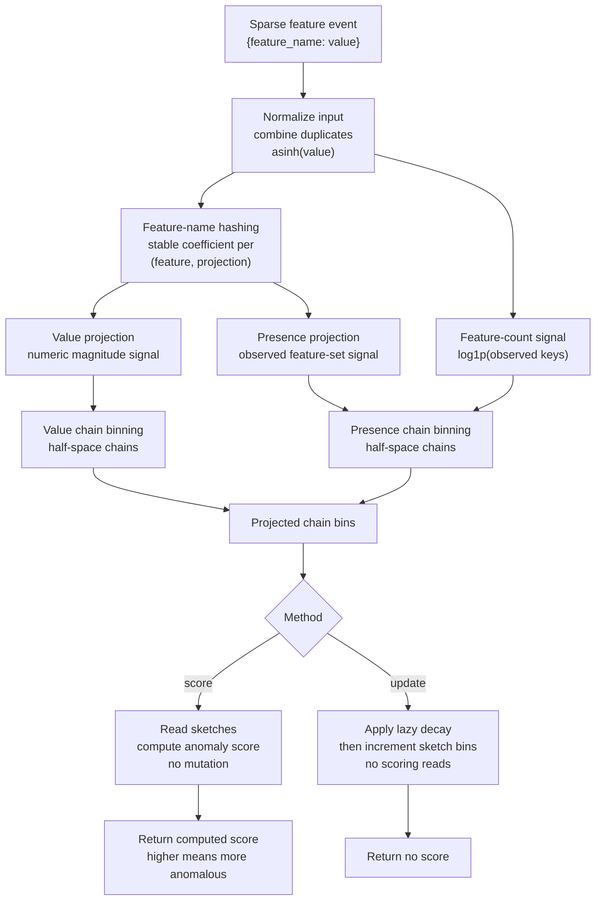
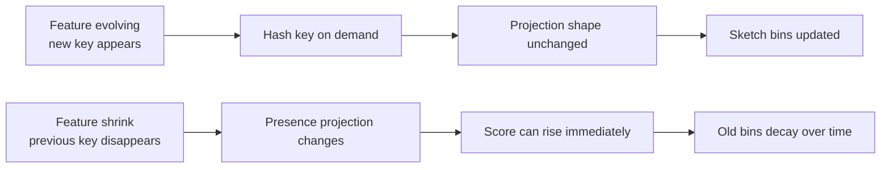
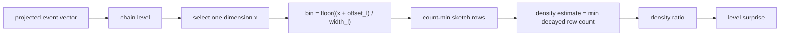
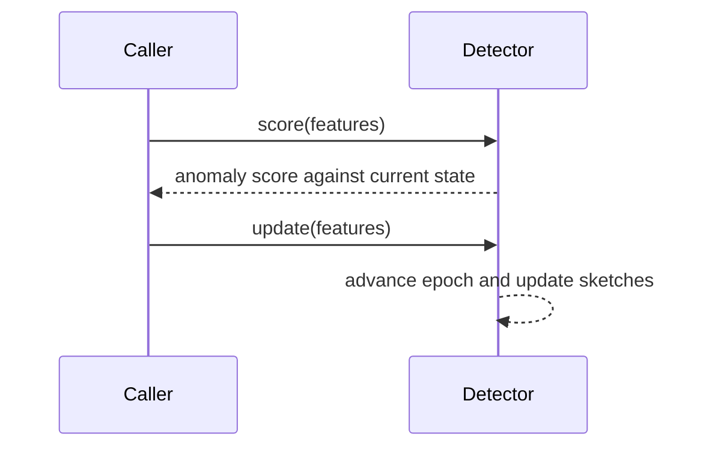
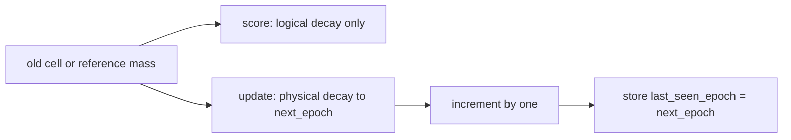

# FeatureSketch Research Notes

This file records the research background and design rationale behind the
`rcf3` FeatureSketch detector. FeatureSketch is an independent library
implementation for sparse, schema-evolving event streams; it is not a
paper-faithful implementation of xStream, RS-Hash, OAD-TDS, or any other
specific publication.

## Goal

FeatureSketch is an online anomaly detector for streams whose schema is not
fixed. Each event is represented only by its currently observed features. New
feature names may appear at any time, and previously common feature names may
stop appearing.

FeatureSketch exposes a compact builder/config surface. The public event shape
remains deliberately small:

```text
detector = FeatureSketch::builder().build()
score = detector.score(features)
detector.update(features)
```

`features` is a sparse sequence of `(feature, value)` pairs. Feature names are
strings, and values are finite `f64` inputs. The detector does not require row
ids, labels, timestamps, a declared schema, or categorical/numeric partitions.

## Literature

### xStream

xStream is the closest direct match in the literature. It targets
feature-evolving streams, where both data points and the feature space evolve
over time. The paper represents stream elements as `(id, feature, delta)`
updates, which allows new feature names and feature-value changes without a
known dimensionality. It combines:

- StreamHash: sparse random projections keyed by feature name.
- Half-space chains: multi-scale density estimation over projected space.
- Count-min sketches: bounded-memory counts for bins.
- Windowed updates: adaptation to non-stationarity.

The KDD page describes xStream as constant-space and constant-time per incoming
update, using projections for high dimensionality and windowed updates for
non-stationarity. The paper also states that, among the compared methods, only
xStream supports evolving feature space and evolving feature values.

Useful sources:

- KDD 2018 page:
  <https://www.kdd.org/kdd2018/accepted-papers/view/xstream-outlier-detection-in-feature-evolving-data-streams>
- Paper PDF:
  <https://www.andrew.cmu.edu/user/lakoglu/pubs/18-kdd-xstream.pdf>
- Project page:
  <https://cmuxstream.github.io/>

Design implications:

- Strong basis for feature growth.
- Strong basis for sparse high-dimensional features.
- The original input contract is not a direct fit because it consumes `id` and
  delta updates. FeatureSketch instead uses a row-event contract that receives
  only the current feature map.
- Feature shrink is not a named first-class goal in the paper, but a sparse
  projection plus decayed/windowed counts can adapt when old features stop
  appearing.

### RS-Hash

RS-Hash is a randomized hashing detector for subspace outliers. IBM's summary
describes it as linear-time with constant space, using randomized hashing and
generalizable to data streams. It is simpler than xStream and relevant as a
baseline, but it assumes a more conventional fixed-row stream and does not solve
unknown feature growth as directly as xStream.

Useful source:

- IBM Research summary:
  <https://research.ibm.com/publications/subspace-outlier-detection-in-linear-time-with-randomized-hashing>

Design implications:

- Good baseline for high-dimensional subspace anomaly detection.
- Weaker fit for feature-evolving schemas because feature-name hashing and the
  projection layer would need to be added.
- Less expressive than half-space chains for multi-scale density.

### OAD-TDS

OAD-TDS is a newer method for trapezoidal data streams, where both instance and
feature space may expand. Its SSRN abstract describes dynamic feature weighting
for feature distribution changes and incremental locality-sensitive hashing for
instance state dynamics.

Useful source:

- SSRN page:
  <https://papers.ssrn.com/sol3/papers.cfm?abstract_id=6030752>

Design implications:

- Relevant because it explicitly targets streams with feature expansion.
- Less mature as a design foundation than xStream: it is recent, and the public
  abstract emphasizes Dask/distributed scheduling rather than a compact
  in-process detector.
- The feature weighting idea is useful, but weights should remain internal to
  preserve the fixed public API.

## Recommendation

FeatureSketch should use a row-event adaptation of xStream, not a direct port
of the original triplet-update algorithm.

The detector accepts a single sparse feature map per event. Internally,
feature-name hashing keeps the model shape stable as new names appear. Sparse
event projection, presence-sensitive projections, and temporal decay handle
shrinking schemas. The resulting detector supports:

- feature evolving: new keys can appear at any time;
- feature shrink: missing keys do not cause dimension errors, and stale
  historical density fades out;
- feature-only input: no `id`, timestamp, label, or schema;
- bounded state: no feature-name registry grows with the historical feature
  universe.

This is a practical detector design rather than a paper-faithful xStream port.
The original xStream setting is more general because it maintains scores for
evolving object ids under delta updates. FeatureSketch narrows the contract to
scoring the next event from its currently observed features.

## Proposed Algorithm

The algorithm is named `FeatureSketch`: feature names define the input space,
and bounded sketches hold the evolving density model.

### Overview





### Input normalization

For every event:

1. Accept sparse features as `(name, value)` pairs.
2. Reject non-finite values.
3. Combine duplicate feature names by summing their values, preserving the key
   even if the sum is exactly zero.
4. Reject the event if any combined value becomes non-finite after summation.
5. Apply `asinh(value)` before value projection so negative and large positive
   values are both supported.

The detector does not require a known feature universe. The core representation
is sparse and named. Dense vectors should be converted by the caller or a thin
wrapper into stable feature names such as `x:0`, `x:1`, and so on; the detector
itself should not expose a separate dense-vector mode.

An empty feature map is valid. It represents an event with no observed keys:
both projection vectors are zero, and `feature_count_signal = log1p(0) = 0`.

Absence is meaningful. A missing feature means the key is not part of the
current event and contributes to the presence signal by not appearing. A feature
whose combined value is exactly zero is still present: it contributes to the
presence projection, but contributes `asinh(0.0) = 0.0` to the value projection.
Categorical values should therefore be encoded as explicit one-hot feature names
only when the category is present, for example `status:401 -> 1.0`; boolean
false and missing categories should both omit the corresponding key unless the
application creates an explicit feature such as `flag:false -> 1.0`.

### Projection

Maintain configurable `K_v` value projection dimensions and `K_p` presence
projection dimensions. For each distinct feature name, compute a stable
feature-name hash once for the event. For each projection channel, feature name
`f`, and projected dimension `k`, derive a stable sparse random coefficient from
the detector seed and `(channel, hash(f), k)`:

```text
coef(channel, hash(f), k) in {-sqrt(3), 0, +sqrt(3)}
P(coef = 0) = 2/3
P(coef = +sqrt(3)) = 1/6
P(coef = -sqrt(3)) = 1/6
```

The feature-name hash should be deterministic and wide enough, for example 128
bits, so accidental name collisions are negligible without storing a feature
registry. If a collision occurs, it behaves like an additional projection
collision rather than unbounded state growth.

For each event, compute two projection vectors. In the formulas below, `value_f`
is the combined raw value for feature `f` before the `asinh` normalization step,
and each sum is over the distinct observed feature names after duplicate
combination:

```text
value_projection[k] =
    sum over observed features f of
        asinh(value_f) * coef("value", hash(f), k)
presence_projection[k] =
    sum over observed features f of
        coef("presence", hash(f), k)
```

Also compute one scalar feature-count signal:

```text
feature_count_signal = log1p(number of observed feature names after combining)
```

Use separate half-space chain ensembles for the value projection and the
presence vector. The presence vector is the presence projection with the
feature-count signal appended as one extra dimension:

```text
presence_vector = concat(presence_projection, [feature_count_signal])
```

The value ensemble detects unusual feature magnitudes. The presence ensemble
detects unusual feature sets, including feature shrink where a previously common
key disappears from an event.

The presence channel is the main adaptation beyond xStream. Without it, an
event that loses a key whose numeric value was usually small can look too close
to normal. Keeping presence in a separate ensemble prevents value-density bins
from hiding schema-change evidence. The scalar feature-count signal gives
feature shrink and expansion a direct low-dimensional path even when random
presence coefficients collide or cancel out.

### Density model

FeatureSketch keeps two independent density models over the projected event:

| Ensemble | Vector scored by the ensemble | What a low-density bin means                                        |
| -------- | ----------------------------- | ------------------------------------------------------------------- |
| Value    | `value_projection`            | Unusual feature magnitudes or value combinations                    |
| Presence | `presence_vector`             | Unusual observed key sets, feature-count changes, or feature shrink |

Each ensemble contains `C` half-space chains. Each chain has fixed depth `D`,
and each chain level is a one-dimensional density estimate over one selected
dimension of the ensemble vector. The selected dimension, bin offset, and
count-min hash seeds are generated from the configured seed, then kept stable
for the detector's lifetime.



For a zero-based level `l = 0..D-1`, the level width is:

```text
base_width(dimension) =
    4.0  for value and presence projection dimensions
    2.0  for the appended feature-count dimension

width_l = base_width(dimension) / 2^l
offset_l ~ Uniform([0, width_l))
bin_l(x) = floor((x + offset_l) / width_l)
bin_volume_ratio_l = width_l / base_width(dimension)
```

The appended feature-count dimension uses the smaller base width `2.0` because
its input is `log1p(count)`, not a random projection sum.

Each level owns a count-min sketch. For a selected bin, the density estimate is
the minimum decayed row count across the `R` sketch rows:

```text
density_estimate_l =
    min over rows r of decayed_count(row = r, bin = bin_l(x))
```

The row hash includes the row and bin, and the value and presence ensembles
store separate sketches. Count-min collisions can only overestimate the density
estimate, which may reduce surprise for that bin but cannot create a false
high-surprise estimate from a common bin.

Each level also tracks a decayed reference mass for normalization. This mass is
updated once per committed event at that level, separately from the per-bin
sketch cells. Normalizing by this mass makes scores less sensitive to warmup
length, bursty traffic, and long-running decay.

The public anomaly score is higher for more anomalous events. Internally,
xStream-style density is lower for anomalies, so FeatureSketch exposes a
surprise score:

```text
observed_mass_ratio_l =
    density_estimate_l / max(reference_mass_l, epsilon_mass)

density_ratio_l = clamp(
    observed_mass_ratio_l / max(bin_volume_ratio_l, epsilon),
    epsilon,
    1.0,
)

level_surprise_l = -log(density_ratio_l)
chain_surprise = max(level_surprise_l) across levels l in the chain
ensemble_surprise = mean(chain_surprise) across chains in the ensemble
```

`epsilon` prevents `log(0)`, and `epsilon_mass` only prevents division by zero.
This is not a calibrated probability; it is a scale-normalized surprise score.
The bin-volume correction keeps shallow and deep half-space levels comparable:
deeper levels are not automatically more surprising only because their bins are
smaller. The upper clamp at `1.0` means common or over-dense bins contribute
zero surprise, while rare bins contribute positive surprise.

The final score is the average of the value-ensemble surprise and the
presence-ensemble surprise:

```text
score = mean(value_surprise, presence_surprise)
```

### Online update order

FeatureSketch keeps scoring and learning as separate operations:

| Operation                    | Mutates detector state | Advances epoch | Returns score | Meaning                                             |
| ---------------------------- | ---------------------- | -------------- | ------------: | --------------------------------------------------- |
| `score(features)`            | No                     | No             |           Yes | Preview anomaly against the current reference state |
| `update(features)`           | Yes                    | Yes            |            No | Commit the event into the reference state           |
| `update_and_score(features)` | Yes                    | Yes            |           Yes | Score first, then commit the same projected event   |

The default online-detection pattern is score-before-update:



`score(features)` still performs input normalization, projection, chain-level
binning, and sketch reads, but it applies decay logically and does not write
back cells, reference masses, epochs, or counters.

`update(features)` performs the same normalization, projection, and chain-level
binning because sketch update locations are defined in projected space. It then
advances counters and writes the selected sketch cells and reference masses, but
it skips scoring reads and anomaly-score reduction.

```text
score(features):
    projected = project(normalize(features))
    return score_projected(projected, current_epoch)

update(features):
    projected = project(normalize(features))
    next_epoch = current_epoch + 1
    update_projected(projected, next_epoch)
    current_epoch = next_epoch

update_and_score(features):
    projected = project(normalize(features))
    next_epoch = current_epoch + 1
    score = score_projected(projected, current_epoch)
    update_projected(projected, next_epoch)
    current_epoch = next_epoch
    return score
```

Calling `score(features)` and then `update(features)` through the public API
computes normalization, projection, and chain binning twice. This is intentional
for the minimal API: `score` remains purely non-mutating, and `update` remains a
commit-only operation. Call `update_and_score(features)` when the caller wants
the score-before-update semantics with one projection pass.

Scoring after update is also valid when the desired meaning is "how anomalous is
this event after it has already been incorporated." It is not the default
online-detection interpretation.

### Adaptation and shrink handling

FeatureSketch adapts with lazy exponential decay, not with an exposed sliding
window. Time is measured in committed events:

```text
epoch_0 = 0
next_epoch = current_epoch + 1
decay_factor(delta) = 0.5^(delta / decay_half_life)
decayed(value, stored_epoch, target_epoch) =
    value * decay_factor(target_epoch - stored_epoch)
```

The same decay rule is used for sketch cells and per-level reference masses:

| State item       | Stored fields                   | Read during `score`                  | Written during `update`                              |
| ---------------- | ------------------------------- | ------------------------------------ | ---------------------------------------------------- |
| Sketch cell      | `(count, last_seen_epoch)`      | Decayed logically at `current_epoch` | Decay to `next_epoch`, then increment selected bins  |
| Reference mass   | `(mass, last_seen_epoch)`       | Decayed logically at `current_epoch` | Decay to `next_epoch`, then increment touched levels |
| Detector counter | `current_epoch`, `entries_seen` | Read only                            | Increment after the projected event is committed     |



This update rule means old evidence fades without deletion. For an untouched
sketch cell, ignoring later count-min collisions into the same row bucket:

```text
if a sketch cell is not touched for delta committed events:
    effective_count = stored_count * 0.5^(delta / decay_half_life)
```

Feature shrink is handled at two levels:

| Shrink type      | What changes                                       | Why the score can react                                                                    | How adaptation happens                         |
| ---------------- | -------------------------------------------------- | ------------------------------------------------------------------------------------------ | ---------------------------------------------- |
| Global shrink    | A feature stops appearing in the stream            | Historical bins for events containing that feature stop receiving direct support           | Their influence decays over time               |
| Per-event shrink | A usually present feature is absent from one event | The presence projection and feature-count signal change even if numeric values look normal | Repeated shrunk events train new presence bins |

The detector intentionally does not store a dense registry of all feature names.
Old features and old bins lose influence through decay; they do not need
explicit deletion. Implementation-internal diagnostics, if added later, must
remain sketch-based and must not add public configuration or memory growth
proportional to the number of feature names ever seen.

FeatureSketch also intentionally does not special-case cold start. Early scores
are unstable because the density sketches have not yet accumulated a useful
reference distribution:

| Phase       | Expected behavior                                                        | Operational guidance                                                                   |
| ----------- | ------------------------------------------------------------------------ | -------------------------------------------------------------------------------------- |
| Cold start  | Scores depend strongly on the first few committed events                 | Ignore or down-rank roughly the first internal half-life when startup behavior matters |
| Warm stream | Decayed counts and reference masses provide a stable comparison baseline | Use score-before-update for online detection                                           |

This is not a readiness invariant; it is a simple default warmup policy.

## Public Configuration and Internal Constants

FeatureSketch exposes the parameters that are meaningful as runtime, accuracy,
memory, or adaptation tradeoffs:

| Public config                  | Default value | Meaning                                                      |
| ------------------------------ | ------------: | ------------------------------------------------------------ |
| Value projection dimensions    |            32 | Sparse random projection capacity for feature magnitudes     |
| Presence projection dimensions |            32 | Independent projection capacity for observed feature sets    |
| Chains per ensemble            |            16 | Ensemble stability versus sketch read/write cost             |
| Chain depth                    |             8 | Multi-scale density resolution versus sketch read/write cost |
| Sketch rows                    |             2 | Count-min collision robustness versus memory and CPU         |
| Sketch buckets                 |          2048 | Count-min bucket capacity versus memory                      |
| Decay half-life                |   2048 events | Adaptation speed for non-stationary streams                  |
| Seed                           |        random | Optional deterministic layout/projection/sketch seed         |

The following values are intentionally fixed internal constants because they
are numerical or scale choices rather than useful application-level tuning
knobs:

| Internal constant            | Value | Reason                                                   |
| ---------------------------- | ----: | -------------------------------------------------------- |
| Projection base bin width    |   4.0 | Base width for value and presence projection dimensions  |
| Feature-count base bin width |   2.0 | Base width for the appended `log1p(count)` dimension     |
| Epsilon                      | 1e-12 | Prevents `log(0)` in density-ratio scoring               |
| Epsilon mass                 | 1e-12 | Prevents division by zero before enough mass accumulates |

If the caller does not set a seed, the builder generates a random seed. The
chosen seed is expanded internally into separate seed material for projection
coefficients, chain layout, and count-min bucket hashing. Serialized state
stores the generated layout and seed material, not just the original seed.

## Complexity

Let:

- `n` be the number of raw `(feature, value)` entries supplied for the event;
- `m` be the number of distinct present feature names after duplicate
  combination, including zero-valued present features;
- `K_v` be the number of value projection dimensions;
- `K_p` be the number of presence projection dimensions;
- `C` be chains per ensemble;
- `D` be chain depth;
- `R` be sketch rows;
- `B` be sketch buckets.

FeatureSketch does not store the historical feature universe, so long-run memory
does not grow with the number of distinct feature names ever observed.

### Time per event

Input normalization is `O(n)` plus the cost of hashing distinct feature names,
which is proportional to their total byte length. Projection then computes one
value coefficient and one presence coefficient for each distinct present feature
and projected dimension:

```text
O(m * (K_v + K_p))
```

Scoring reads sketch cells for every chain level in both ensembles. With
count-min sketches, each level reads `R` cells and uses the minimum decayed count
as that level's density estimate:

```text
O(2 * C * D * R)
```

Committed updates reuse the projected chain bins, write the same number of
sketch cells, and update the same per-level reference masses:

```text
O(2 * C * D * R)
```

Including duplicate-combination cost, the method costs are:

```text
score(features):            O(n + m * (K_v + K_p) + 2 * C * D * R)
update(features):           O(n + m * (K_v + K_p) + 2 * C * D * R)
```

Calling `score(features)` followed by `update(features)` through the public API
performs projection/binning twice, then performs both the scoring reads and
committed-update writes:

```text
score(features) + update(features):
    O(2 * n + 2 * m * (K_v + K_p) + 4 * C * D * R)
```

With the fixed defaults, the sketch part is constant per event. Runtime is
linear in the number of supplied entries plus the number of distinct present
features in the event, and independent of the number of feature names seen
historically.

### Space

The persistent sketch storage is:

```text
O(2 * C * D * R * B)
```

The factor `2` is for the value and presence ensembles. Per-level reference
masses add `O(2 * C * D)` state, which is dominated by sketch cells.

Per-event temporary storage materializes the normalized event, projection
vectors, and chain-level bin assignments:

```text
O(K_v + K_p + m + 2 * C * D)
```

where `m` covers the normalized event map when duplicate feature names must be
combined. If the input is already a map with unique keys, then `n = m`. An
implementation can recompute bin assignments instead of storing them, reducing
temporary storage to `O(K_v + K_p + m)` at the cost of extra hash/binning work.

## API Sketch

Rust:

```rust
use rcf3::FeatureSketch;

let mut detector = FeatureSketch::builder()
    .value_projection_dims(32)
    .presence_projection_dims(32)
    .chains_per_ensemble(16)
    .chain_depth(8)
    .sketch_rows(2)
    .sketch_buckets(2048)
    .decay_half_life(2048)
    .seed(42)
    .build()?;

let event = [
    ("endpoint:/login", 1.0),
    ("status:401", 1.0),
    ("bytes", 812.0),
];
let anomaly_score = detector.score(event)?;
detector.update(event)?;

let next_score = detector.score([
    ("endpoint:/admin", 1.0),
    ("status:401", 1.0),
    ("bytes", 12000.0),
])?;
```

Python:

```python
from rcf3 import FeatureSketch

detector = FeatureSketch(
    value_projection_dims=32,
    presence_projection_dims=32,
    chains_per_ensemble=16,
    chain_depth=8,
    sketch_rows=2,
    sketch_buckets=2048,
    decay_half_life=2048,
    seed=42,
)
event = {
    "endpoint:/login": 1.0,
    "status:401": 1.0,
    "bytes": 812.0,
}
anomaly_score = detector.score(event)
detector.update(event)
```

The categorical/numeric split is intentionally absent. Categorical features are
represented by one-hot style feature names with value `1.0`; numeric features
use their natural finite values. One-hot encoders should omit inactive
categories rather than emitting inactive keys with value `0.0`, because a
zero-valued key is still treated as present.

## Serialization

Serialized state should include the fixed constants and a format version so
future versions can reject incompatible states cleanly. Store the generated
chain layout rather than only the seed, so restored detectors are independent of
later changes to layout generation code. Projection coefficient seed material
must still be stored because future unseen feature names need reproducible
`coef(channel, hash(f), k)` values. At minimum, the state must store:

- projection dimensions;
- channel-separated projection coefficient seed material;
- chain dimensions, bin widths, bin offsets, and bin-volume ratios;
- count-min row hash seed material;
- sketch row and bucket counts;
- decay half-life and current event counter;
- sketch cell counts and epochs;
- chain-level reference masses and epochs.

## Validation Plan

Minimum regression scenarios:

1. Feature growth: using a deterministic internal seed, warm for at least one
   internal half-life on `{a, b}`, collect a small baseline of normal `{a, b}`
   scores, then assert `{a, b, new_feature}` scores above the baseline 95th
   percentile before adaptation.
2. Feature shrink: using a deterministic internal seed, warm for at least one
   internal half-life on `{a, b, c}`, collect a small baseline of normal
   `{a, b, c}` scores, then assert `{a, b}` scores above the baseline 95th
   percentile before adaptation.
3. Shrink adaptation: after many `{a, b}` updates, assert `{a, b}` no longer
   remains permanently anomalous.
4. Sparse high cardinality: stream many unique feature names and assert memory
   remains bounded by sketch sizes.
5. Score purity: `score(x)` should not mutate detector state; scoring the same
   event twice from the same state should return the same value.
6. Duplicate names: duplicate feature entries should match a pre-combined map.
7. Zero and absence: a feature whose combined value is exactly zero should still
   affect the presence projection and should not match omitting that feature from
   the same event.
8. Signed values: positive and negative finite values are accepted; NaN,
   infinity, and non-finite duplicate sums are rejected.
9. Logical decay purity: after unrelated updates advance the event counter,
   `score(x)` should apply decay logically but leave stored sketch cell epochs
   and chain-level reference-mass epochs unchanged.
10. Score-before-update workflow: recording `score(x)` before `update(x)` should
    preserve the pre-update anomaly score, and the subsequent `update(x)` should
    affect later scores for the same or related events.
11. Serialization roundtrip: after warmup and several scored events, serialize
    and restore the detector, then assert that `score(x)` and the next
    `update(x)` produce the same subsequent state as the original detector,
    including future unseen feature names.
12. Empty event: `{}` is accepted, scores deterministically from the current
    state, and updates the zero-projection bins without creating a feature-name
    registry entry.

## Conclusion

FeatureSketch is an xStream-inspired sparse projection detector with an
explicit presence projection and internal temporal decay. It is a better fit for
schema-evolving streams than adapting `Forest`, `OnlineIForest`, or `MStream`:
those detectors require fixed dimensions or separate feature categories, while
FeatureSketch lets the schema grow and shrink without a public schema or tuning
surface.

---

Reviewed and signed by Codex.
