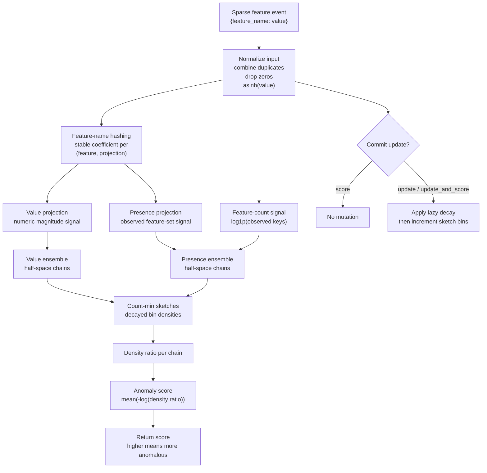
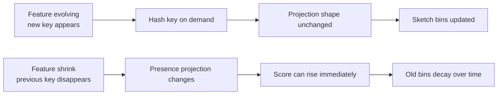

# FeatureSketch

## Goal

FeatureSketch is an online anomaly detector for streams whose schema is not
fixed. Each event is represented only by its currently observed features. New
feature names may appear at any time, and previously common feature names may
stop appearing. The public API keeps algorithm parameters internal.

The public shape is deliberately small:

```text
detector = Detector()
score = detector.update_and_score(features)
preview = detector.score(features)
```

`features` is a sparse map from feature name to finite numeric value, or an
equivalent sequence of `(feature, value)` pairs. The detector does not require
row ids, labels, timestamps, a declared schema, categorical/numeric partitions,
or tuning parameters.

## Literature

### xStream

xStream is the closest direct match in the literature. It targets
feature-evolving streams, where both data points and the feature space evolve
over time. The paper represents stream elements as `(id, feature, delta)`
updates, which allows new feature names and feature-value changes without a
known dimensionality. It combines:

- StreamHash: sparse random projections keyed by feature name.
- Half-space chains: multi-scale density estimation over projected space.
- Count-min sketches: bounded-memory counts for bins.
- Windowed updates: adaptation to non-stationarity.

The KDD page describes xStream as constant-space and constant-time per incoming
update, using projections for high dimensionality and windowed updates for
non-stationarity. The paper also states that, among the compared methods, only
xStream supports evolving feature space and evolving feature values.

Useful sources:

- KDD 2018 page:
  <https://www.kdd.org/kdd2018/accepted-papers/view/xstream-outlier-detection-in-feature-evolving-data-streams>
- Paper PDF:
  <https://www.andrew.cmu.edu/user/lakoglu/pubs/18-kdd-xstream.pdf>
- Project page:
  <https://cmuxstream.github.io/>

Design implications:

- Strong basis for feature growth.
- Strong basis for sparse high-dimensional features.
- The original input contract is not a direct fit because it consumes `id` and
  delta updates. FeatureSketch instead uses a row-event contract that receives
  only the current feature map.
- Feature shrink is not a named first-class goal in the paper, but a sparse
  projection plus decayed/windowed counts can adapt when old features stop
  appearing.

### RS-Hash

RS-Hash is a randomized hashing detector for subspace outliers. IBM's summary
describes it as linear-time with constant space, using randomized hashing and
generalizable to data streams. It is simpler than xStream and relevant as a
baseline, but it assumes a more conventional fixed-row stream and does not solve
unknown feature growth as directly as xStream.

Useful source:

- IBM Research summary:
  <https://research.ibm.com/publications/subspace-outlier-detection-in-linear-time-with-randomized-hashing>

Design implications:

- Good baseline for high-dimensional subspace anomaly detection.
- Weaker fit for feature-evolving schemas because feature-name hashing and the
  projection layer would need to be added.
- Less expressive than half-space chains for multi-scale density.

### OAD-TDS

OAD-TDS is a newer method for trapezoidal data streams, where both instance and
feature space may expand. Its SSRN abstract describes dynamic feature weighting
for feature distribution changes and incremental locality-sensitive hashing for
instance state dynamics.

Useful source:

- SSRN page:
  <https://papers.ssrn.com/sol3/papers.cfm?abstract_id=6030752>

Design implications:

- Relevant because it explicitly targets streams with feature expansion.
- Less mature as a design foundation than xStream: it is recent, and the public
  abstract emphasizes Dask/distributed scheduling rather than a compact
  in-process detector.
- The feature weighting idea is useful, but weights should remain internal to
  preserve the fixed public API.

## Recommendation

FeatureSketch should use a row-event adaptation of xStream, not a direct port
of the original triplet-update algorithm.

The detector accepts a single sparse feature map per event. Internally,
feature-name hashing keeps the model shape stable as new names appear. Sparse
event projection, presence-sensitive projections, and temporal decay handle
shrinking schemas. The resulting detector supports:

- feature evolving: new keys can appear at any time;
- feature shrink: missing keys do not cause dimension errors, and stale
  historical density fades out;
- feature-only input: no `id`, timestamp, label, or schema;
- fixed public behavior: sketch, projection, and decay constants stay internal.

This is a practical detector design rather than a paper-faithful xStream port.
The original xStream setting is more general because it maintains scores for
evolving object ids under delta updates. FeatureSketch narrows the contract to
scoring the next event from its currently observed features.

## Proposed Algorithm

The algorithm is named `FeatureSketch`: feature names define the input space,
and bounded sketches hold the evolving density model.

### Overview





### Input normalization

For every event:

1. Accept sparse features as `(name, value)` pairs.
2. Reject non-finite values.
3. Combine duplicate feature names by summing their values.
4. Drop exact zero values after combination.
5. Apply `asinh(value)` before projection so negative and large positive values
   are both supported.

The detector does not require a known feature universe. A dense vector can be
accepted by converting each index to a stable string key internally, but the
core representation should be sparse.

### Projection

Maintain a fixed number of projected dimensions `K`, chosen by internal
constant. For each feature name `f` and projected dimension `k`, derive a stable
sparse random coefficient from the detector seed and `(f, k)`:

```text
coef(f, k) in {-sqrt(3), 0, +sqrt(3)}
P(coef = 0) = 2/3
P(coef = +sqrt(3)) = 1/6
P(coef = -sqrt(3)) = 1/6
```

For each event, compute two projection vectors:

```text
value_projection[k] = sum(asinh(value_f) * coef(f, k))
presence_projection[k] = sum(coef(f, k)) for observed feature names
```

Also compute one scalar feature-count signal:

```text
feature_count_signal = log1p(number of observed feature names)
```

Use separate half-space chain ensembles for the value projection and the
presence projection plus feature-count signal. The value ensemble detects
unusual feature magnitudes. The presence ensemble detects unusual feature sets,
including feature shrink where a previously common key disappears from an
event.

The presence channel is the main adaptation beyond xStream. Without it, an
event that loses a key whose numeric value was usually small can look too close
to normal. Keeping presence in a separate ensemble prevents value-density bins
from hiding schema-change evidence. The scalar feature-count signal gives
feature shrink and expansion a direct low-dimensional path even when random
presence coefficients collide or cancel out.

### Density model

FeatureSketch uses two ensembles of half-space chains over the projected
vectors:

- each chain has fixed depth `D`;
- each level chooses a projected dimension and bin width from seeded constants;
- each level owns a count-min sketch for bin counts;
- scoring uses the minimum extrapolated density across levels;
- each chain tracks a decayed reference mass for normalization;
- each ensemble converts low normalized densities into high anomaly
  contributions and averages those contributions.

The public anomaly score is higher for more anomalous events. Internally,
xStream-style density is lower for anomalies, so FeatureSketch exposes a
surprise score:

```text
density_ratio_chain = clamp(
    density_chain / max(reference_mass_chain, 1),
    epsilon,
    1.0,
)
score = mean(-log(density_ratio_chain))
```

where `epsilon` is an internal constant that prevents `log(0)`. This is not a
calibrated probability; it is a volume-normalized surprise score. Normalizing by
decayed reference mass keeps the score scale more stable across warm streams,
traffic bursts, and long-running decay than a raw reciprocal density.

The final score is the average of the value-ensemble surprise and the
presence-ensemble surprise:

```text
score = mean(value_surprise, presence_surprise)
```

### Online update order

For `score(features)`, compute the score against the current reference state
without mutation.

For `update_and_score(features)`, score first, then update. This avoids teaching
the detector an event before judging whether it is anomalous. It also matches
common online anomaly-detection usage and makes first-seen feature spikes easier
to observe.

For `update(features)`, perform only the update.

### Adaptation and shrink handling

FeatureSketch uses lazy exponential decay. It adapts continuously without
exposing a window boundary in the public API:

- every update increments an internal event counter;
- each sketch cell stores `(count, last_seen_epoch)`;
- reading or writing a cell applies lazy decay based on elapsed events;
- old features and old bins naturally lose influence without explicit deletion.

This handles global feature shrink: if a feature disappears from the stream,
its historical bins stop receiving updates and decay away. It handles per-event
feature shrink through the presence projection because the event's observed key
set changes even if values are otherwise normal.

FeatureSketch intentionally does not special-case cold start. Early scores are
unstable because the density sketches have not yet accumulated a useful
reference distribution. Production pipelines can ignore or down-rank the first
internal half-life of scores when startup behavior matters.

The detector should not maintain a dense registry of all feature names. A small
optional diagnostic sketch for feature frequencies is acceptable, but the core
algorithm should remain bounded by the projection/chains/sketch constants, not
by the number of feature names ever seen.

## Fixed Internal Defaults

These values are fixed implementation constants rather than builder parameters
in the first public version:

| Internal constant              |    Suggested value | Reason                                                            |
| ------------------------------ | -----------------: | ----------------------------------------------------------------- |
| Value projection dimensions    |                 32 | Enough for sparse random projection while keeping update cost low |
| Presence projection dimensions |                 32 | Keeps schema-change detection independent from value magnitudes   |
| Chains per ensemble            |                 16 | Ensemble stability without large memory                           |
| Chain depth                    |                  8 | Multi-scale bins without excessive sketch reads                   |
| Sketch rows                    |                  2 | Same practical shape as current `MStream` defaults                |
| Sketch buckets                 |               2048 | More room than `MStream` because projected bins are more varied   |
| Decay half-life                |        2048 events | Tracks recent behavior while preserving a useful baseline         |
| Seed                           | fixed library seed | Deterministic behavior without a public option                    |

These are implementation constants, not public configuration. Test-only
constructors may inject a seed internally, but the public detector should not
expose tuning knobs in the first version.

## API Sketch

Rust:

```rust
use rcf3::FeatureSketch;

let mut detector = FeatureSketch::new();

let score = detector.update_and_score([
    ("endpoint:/login", 1.0),
    ("status:401", 1.0),
    ("bytes", 812.0),
])?;

let preview = detector.score([
    ("endpoint:/admin", 1.0),
    ("status:401", 1.0),
    ("bytes", 12000.0),
])?;
```

Python:

```python
from rcf3 import FeatureSketch

detector = FeatureSketch()
score = detector.update_and_score({
    "endpoint:/login": 1.0,
    "status:401": 1.0,
    "bytes": 812.0,
})
```

The categorical/numeric split is intentionally absent. Categorical features are
represented by one-hot style feature names with value `1.0`; numeric features
use their natural finite values.

## Remaining Design Decisions

1. Dense input support: accepting `&[f32]` is convenient, but sparse named
   features are the better primary contract for evolving/shrinking schemas.
2. Serialization: include the fixed constants in serialized state so future
   versions can reject incompatible states cleanly.

## Validation Plan

Minimum regression scenarios:

1. Feature growth: warm on `{a, b}`, then score `{a, b, new_feature}` and assert
   it scores higher than a normal `{a, b}` event before adaptation.
2. Feature shrink: warm on `{a, b, c}`, then score `{a, b}` and assert it scores
   higher than a normal `{a, b, c}` event.
3. Shrink adaptation: after many `{a, b}` updates, assert `{a, b}` no longer
   remains permanently anomalous.
4. Sparse high cardinality: stream many unique feature names and assert memory
   remains bounded by sketch sizes.
5. Preview parity: from the same starting state, `score(x)` should return the
   same score as `update_and_score(x)`, and only `update_and_score(x)` should
   mutate detector state.
6. Duplicate names: duplicate feature entries should match a pre-combined map.
7. Signed values: positive and negative finite values are accepted; NaN and
   infinity are rejected.

## Conclusion

FeatureSketch is an xStream-inspired sparse projection detector with an
explicit presence projection and internal temporal decay. It is a better fit for
schema-evolving streams than adapting `Forest`, `OnlineIForest`, or `MStream`:
those detectors require fixed dimensions or separate feature categories, while
FeatureSketch lets the schema grow and shrink without a public schema or tuning
surface.
